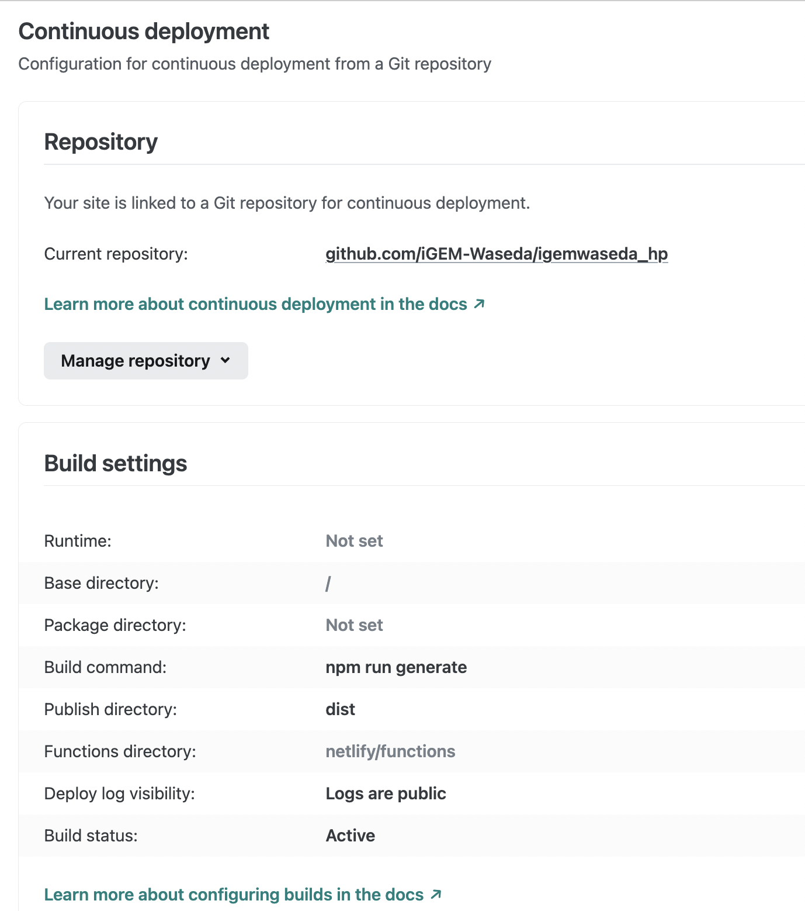

# igemwaseda_hp
## 概要
- 本レポジトリは、iGEM Wasedaの公式HPを作成するためのものである。
- iGEM Wasedaの公式HPは、[こちら](https://igemwaseda.org/)から確認できる。
- 技術スタックは、Nuxt.jsとTailwind CSSを使用している。
- ほとんどのページをmarkdownで作成し、一部のページはVueコンポーネントで作成している。


## フォルダ構成
```bash
.
├── README.md                         # 本ドキュメントファイル
├── assets                            # 静的ファイル用のフォルダ(ファイル名が変更される)
│   ├── css                           # CSS用のフォルダ
│   │   └── main.css                  # CSSファイル
│   └── image                         # 画像用のフォルダ(コンポーネントで使用)
│       ├── member                    # メンバー画像用のフォルダ    
│       │   └── xxx.png
│       └── xxx.png
├── components                        # Vueコンポーネント用のフォルダ
│   ├── Atoms
│   │   ├── InstagramBtn.vue          # ページ下部のInstagramボタン
│   │   ├── Logo.vue                  # ページ上部のロゴ
│   │   ├── TwitterBtn.vue            # ページ下部のTwitterボタン
│   │   └── YoutubeBtn.vue            # ページ下部のYoutubeボタン
│   ├── MarkDown.vue                  # markdownを表示するためのコンポーネント
│   ├── Molecules               
│   │   ├── Crowdfunding.vue          # クラウドファンディングのページ(現在は未使用)
│   │   ├── MemberCard.vue            # メンバ紹介のカード(ポップアップ含む)
│   │   ├── Section.vue               # トップページの各セクション用のコンポーネント
│   │   └── Social.vue                # ページ下部のSNSボタンが並んでいる部分
│   └── Organisms
│       ├── Footer.vue                # フッター
│       ├── Gallery.vue               # ギャラリー(/teamでwet, dry...が並んでいる部分)
│       ├── HomeImage.vue             # トップページの画像
│       └── Navbar.vue                # ナビゲーションバー
├── docs                              # ドキュメント用のフォルダ
│   └── netlify_configure.png
├── layouts                           # レイアウト用のフォルダ
│   └── default.vue                   # デフォルトレイアウト
├── markdowns                         # markdownファイル用のフォルダ
│   ├── design.md                     # design班の説明
│   ├── dry.md                        # dry班の説明
│   ├── events.md                     # 活動内容について
│   ├── fund.md                       # 寄付・協賛のご案内
│   ├── human-practice.md             # HP班の説明
│   ├── igem.md                       # iGEMについて
│   ├── member.md                     # メンバーページ(タイトルのみ)
│   ├── projects.md                   # プロジェクトの
│   ├── synbio.md                     # 合成生物学について
│   ├── team.md                       # チームについて(タイトルのみ)
│   └── wet.md                        # wet班の説明
├── middleware                        # ミドルウェア用のフォルダ
│   └── redirect.js                   # URLの最後の/のリダイレクト
├── nuxt.config.js                    # Nuxt.jsの設定ファイル
├── package-lock.json                 # npmのパッケージ管理ファイル
├── package.json                      # npmのパッケージ管理ファイル 
├── pages                             # ページ用のフォルダ(Vueコンポーネント)
│   ├── events.vue                    # 活動内容について(events.mdの読み込みとTwitterの埋め込み)
│   ├── fund.vue                      # 寄付・協賛のご案内(fund.md読み込みと.vue自体に説明)
│   ├── igem.vue                      # iGEMについて(igem.mdの読み込み)
│   ├── index.vue                     # トップページ(.vue自体の説明がメイン)
│   ├── member.vue                    # メンバーページ(member.mdはタイトルのみとintroductionPopup.vueに情報を渡している)
│   ├── projects.vue                  # プロジェクトのページ(projects.md読み込み)
│   ├── synbio.vue                    # 合成生物学について(synbio.md読み込み)
│   └── team.vue                      # チームについて(team.mdはタイトルのみ, wet.md, dry.md, design.md, 
│                                     #             human-practice.mdがメイン, .vue自体にも一部説明)
├── static                            # 静的ファイル用のフォルダ(ファイル名が変更されないため、markdownで使用)
│   ├── favicon.ico                   # アイコン
│   ├── images                        # 画像用のフォルダ(markdownで使用)
│   │   └── xxx.png
│   └── robots.txt                    # スクレイピング対策
├── store                             # Vuexストア用のフォルダ
│   ├── README.md
│   └── index.js                      # ナビゲーションバーの名前と対応するmarkdownファイルの名前を管理
└── tailwind.config.js                # Tailwind CSSの設定ファイル
```
## 環境構築
### 前提
以下の環境で動作確認済み、他の環境ｄ
- macOS Monterey 12.4 (Apple M1)
- Node.js v16.14.2
- npm v8.5.0

### 手順
以下のコマンドで入力すると、パッケージのインストールが始まる。
```bash
# 必要なパッケージをインストール
$ npm install
```

次に、以下のコマンドで開発用サーバーを立ち上げる。
```bash
# 開発用サーバーを立ち上げる
$ npm run dev
```

## 開発
開発用のサーバーを立ち上げた状態で、`localhost:3000`にアクセスすると、開発用のページが表示される。ホットリロードが効いているので、ファイルを編集する度に、自動で更新される。
```bash
# 開発用サーバーを立ち上げる
$ npm run dev
```

一通りの開発が終わったら、以下のコマンドで静的サイトを生成し、問題がないか確認する。
```bash
# 静的サイトを生成する
$ npm run generate

# 静的サイトを生成した後、ローカルサーバーを立ち上げる
$ npx serve dist
```

## デプロイ
- 本ページは、netlifyを利用してデプロイしている。
- [本レポジトリ](https://github.com/iGEM-Waseda/igemwaseda_hp)のgithubのmainブランチにpushすると、netlifyが自動でデプロイしてくれる。サイト更新にあたって、netlify上で設定は必要ない。
- netlify上では、`npm run generate`を実行して、静的サイトを生成し、`dist`フォルダをデプロイするように設定している。以下のように、netlifyの設定を行う。
- netlifyのアカウントは山本が管理しているので、無料プランではチームを追加できないため、アカウントを移行するか、引き続き山本のアカウントを利用するか、相談して決める。




## 原稿追加手順
- 他のメンバーが書いた原稿を、サイト管理者がmarkdownに変換して、サイトに追加する手順を説明する。
- 注意点として画像などは必ず生データをもらうこと。boxnote, google docs, wordなどから画像をダウンロードすることは難しいため。
- 数式は現状対応していないので、数式を使う場合は、画像として保存してもらうこと。
- 画像は、できるだけpng形式で保存してもらうこと。jpg形式は、画質が悪くなるため。

### 文章
1. 原稿のテキストをコピー
2. `markdonws/hoge.md`を作成し、テキストをペースト
3. `##` `###` `####`などを利用して、見出しを作成
4. リンクは `[text](link)`のフォーマットで書く
5. 太字は`**text**`で書く
6. 箇条書きは`-`で書く

### 画像
1. 画像を`static/images`以下に格納する
2. ファイル名をページ名や内容に関連させる 例:`wet-1.png`
3. 原稿内で`/images/hoge.png` をpathで指定する 
4. 画像はtableを利用してfig titleを付けている
  ```
  ||
  |:--:|
  |<b>Fig.1 遺伝子設計ソフトウェア Snap Gene®の作業画面</b>|
  ```
5. iframeなどはmarkdown原稿にべた書きしている

## メンバー追加手順
1. `assets/image/member`にメンバーの画像を格納する
2. `pages/member.vue`を開き、学年のセクションにメンバーの情報を追加する
以下は`team-leader`のセクションの例
```.vue
<template>
    <div class="max-w-screen-lg px-4 md:px-8 mx-auto sm:my-8 my-16">
      <h2 class="text-gray-800 text-2xl md:text-4xl font-bold text-start my-8">
        Team Leaders
      </h2>
      <div
        class="grid grid-cols-2 md:grid-cols-4 gap-x-4 lg:gap-x-8 gap-y-8 lg:gap-y-12"
      >
        <MemberCard
          :imagePath="require('@/assets/image/member/ryota-abe.png')"
          :name="`阿部 諒太`"
          :team="`【幹事長】/ Wet`"
          :major="`先進理工学部 生命医科学科`"
          :highSchool="`私立武蔵高校`"
          :hobbies="`サッカー、格闘技観戦、漫画`"
          :introText="`有り余った体力を活かしてチームで世界に羽ばたきたいです！ `"
        />
    ...
      </div>
    </div>
</template>
```
記載できる情報は以下の通り
- 名前 `name`
- チーム名 `team`
- 学科 `major`
- 高校名 `highSchool`
- 趣味 `hobbies`
- 一言 `introText`
- 画像パス `imagePath` (assets/image/member/xxx.png)
